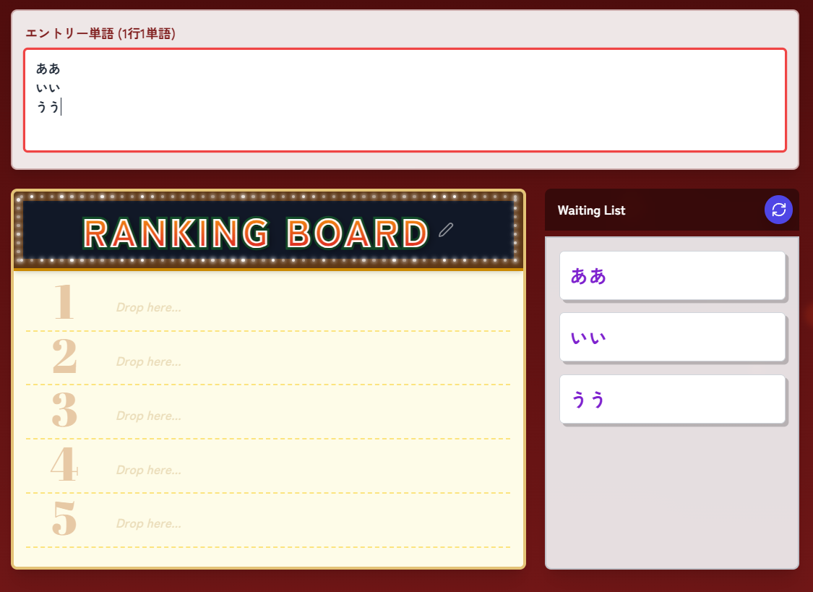
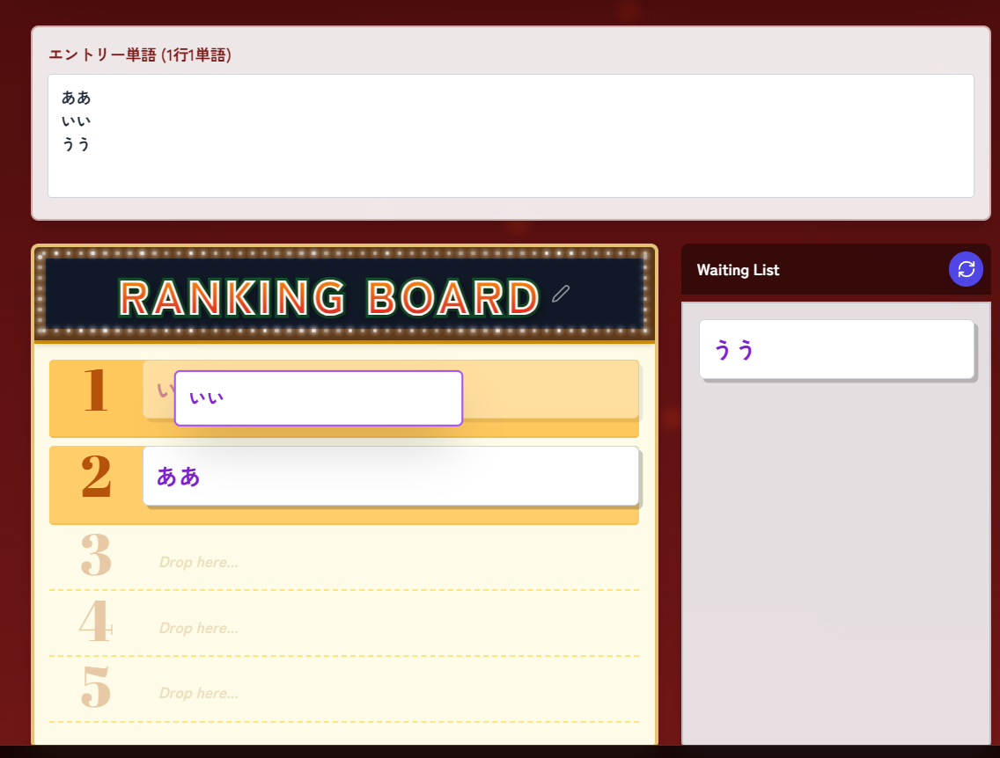

# Popular-Word-Maker

流行語ランキングを直感的に作って、画像やPDFとして保存できるWebアプリです。  
入力した単語をドラッグ&ドロップで並べ替え、ランキング表を作成できます。

## アプリ概要

- テキスト入力で単語カードを自動生成
- ドラッグ&ドロップでランキングを作成
- ランキングタイトルを編集可能
- PNG / PDF / テキスト / 単語集画像として保存可能

## スクリーンショット

このREADMEは次の3枚を参照します。

- img/Overview.png
- img/Input-word.png
- img/Making.png

### 1. アプリ全体画面


### 2. 単語入力後にカードが生成された状態



### 3. カードをランキングへドラッグして配置している状態



## 操作方法

1. エントリー単語欄に、1行1単語で入力します。
2. 右側 Waiting List に単語カードが自動で並びます。
3. カードを左側 Ranking Board にドラッグ&ドロップします。
4. タイトル文字をクリックするとランキング名を編集できます。
5. 画面下のボタンから PNG / PDF / テキスト / 単語集画像を保存します。

## セットアップ

### 前提

- Node.js 18 以上推奨
- npm

### インストール

```bash
npm install
```

### 開発サーバー起動

```bash
npm run dev
```

### 本番ビルド

```bash
npm run build
```

### ビルド確認

```bash
npm run preview
```

### GitHub Pages へデプロイ

```bash
npm run deploy
```

## ファイル構成（大まか）

### ルート

- App.tsx: 画面全体を組み立てるエントリコンポーネント
- index.tsx: Reactアプリのマウント処理
- index.html: HTMLテンプレート
- package.json: スクリプト、依存関係、デプロイ設定
- vite.config.ts: Vite設定

### components

- components/Title.tsx: 上部タイトル表示
- components/HowToUse.tsx: 使い方パネル
- components/InputArea.tsx: 単語入力テキストエリア
- components/RankingBoard.tsx: ランキング本体表示（順位スロット含む）
- components/WaitingList.tsx: 待機カード一覧とシャッフルボタン
- components/SortableItem.tsx: ドラッグ可能な単語カード
- components/Droppable.tsx: ドロップ領域ラッパー
- components/Footer.tsx: 保存ボタン群
- components/Snackbar.tsx: 通知表示
- components/GitHubLink.tsx: GitHubリンクボタン
- components/CurtainBackground.tsx: 背景装飾（カーテン）
- components/FlameBackground.tsx: 背景装飾（炎）
- components/LEDStrip.tsx: 電飾風UIパーツ

### hooks

- hooks/useRankingManager.ts: 入力同期、D&D、並び替え、空スロット計算などの状態管理
- hooks/useExportActions.ts: PNG/PDF/テキスト/単語集画像のエクスポート処理

### utils

- utils/ranking.ts: 単語行解析、リスト同期、空スロット算出などの純粋ロジック

### types

- types/word.ts: WordItem 型定義

### img

- img/github-mark-white.png: GitHubリンク用アイコン
- img/Obake.png: おばけ画像アセット
- img/readme-01-overview.png: README用スクリーンショット（全体）
- img/readme-02-input-and-cards.png: README用スクリーンショット（入力後）
- img/readme-03-drag-and-rank.png: README用スクリーンショット（ドラッグ時）

## 主な利用ライブラリ

- React
- TypeScript
- Vite
- @dnd-kit/core, @dnd-kit/sortable
- html2canvas
- jspdf
- lucide-react

## 注意事項

- 画面を離れるときにブラウザの離脱確認が表示されます。
- 画像/PDFの出力はブラウザ実行環境に依存します。

